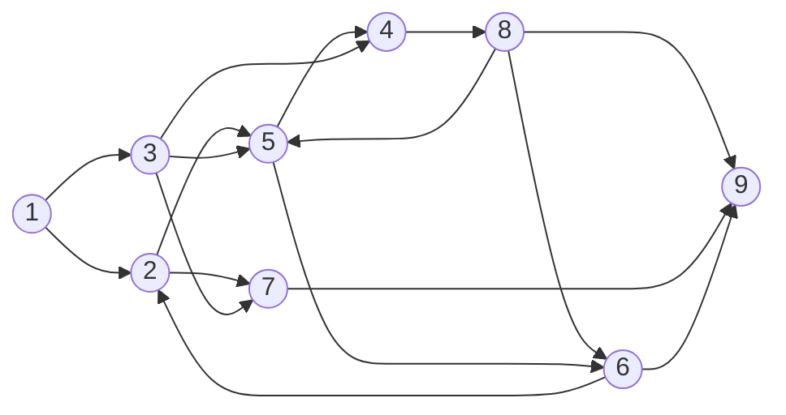

## 仿真示例一


- 初始状态 1 6 （60%， 40%）
- 状态转移矩阵
- 约束、终止条件
	- 到达末端节点9
	- 最长时间T：10

````gfm
```flow
st=>start: Start
op=>operation: Your Operation
cond=>condition: Yes or No?
e=>end

st->op->cond
cond(yes)->e
cond(no)->op
````